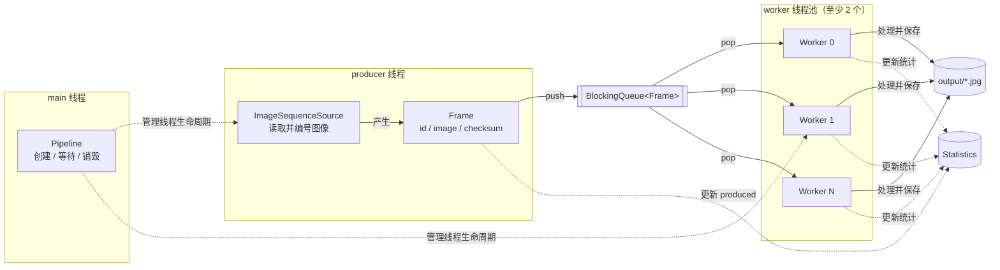

# 作业 3：迷你视觉处理流水线

本作业要求你修复一个简化的多线程视觉处理系统。

## 背景与目标

系统从 `assets/` 依次读取图像。一个 producer 线程把图像包装成 `Frame`
并放入阻塞队列，多个 worker 线程从队列取出帧、执行已有的图像处理算法，
再把结果写入输出目录。所有 worker 还会更新同一个统计对象。

仓库中的初始代码可以编译，但故意保留了若干并发与生命周期缺陷。你的最终目标是：

> 每个输入帧都恰好被处理和保存一次，帧内容在处理前保持不变，并且流水线在任何合法的退出路径上都能安全关闭。

“恰好一次”同时表示不能漏帧，也不能让多个 worker 重复处理同一帧。

## 系统结构

下面的实线表示帧的数据流，虚线表示对共享状态的访问。图中的 producer 和
每个 worker 都运行在独立线程中；`main` 线程负责创建、等待和销毁整条流水线。



各组件的职责如下：

| 组件 | 运行位置 | 职责 | 需要关注的问题 |
| --- | --- | --- | --- |
| `ImageSequenceSource` | producer 线程 | 读取图像、生成递增的帧 ID 和校验值 | 底层图像缓冲区能否被后续读取复用 |
| `Frame` | 在线程之间移动 | 携带 ID、图像及预期校验值 | `cv::Mat` 的拷贝语义与图像数据所有权 |
| `BlockingQueue<Frame>` | producer 与 workers 之间 | 传递帧；关闭后唤醒等待者 | 队列关闭与消费完剩余元素的时机 |
| `ImageProcessor` | worker 线程 | 执行已经给定的图像处理算法 | 本作业不要求修改算法 |
| `Statistics` | 多线程共享 | 记录 produced、processed、saved、corrupted | 复合读写是否线程安全 |
| `Pipeline` | main 线程创建和销毁 | 启动、等待并管理所有线程 | 析构时不能留下仍在运行的线程 |

一次正常运行应当经历以下阶段：

1. `Pipeline::start()` 创建 worker 线程和 producer 线程。
2. producer 持续读取帧并将其放入队列。
3. 多个 worker 并发取帧；同一个队列元素只能被一个 worker 取走。
4. 输入耗尽后，等待中的 worker 最终都能停止。
5. `Pipeline::wait()` 返回，或 `Pipeline` 被直接销毁时，所有已启动线程都已被安全回收。

初始实现并不一定满足这些描述。你需要根据代码、测试和运行现象定位原因，
而不是把上面的步骤当作已经实现的保证。

## 你的任务

### 1. 修复实现

从下列文件中的 `TODO` 开始排查：

- `src/frame_source.cpp`
- `src/pipeline.cpp`
- `include/statistics.hpp`
- `src/statistics.cpp`

`TODO` 指出了问题所在的区域。你可以修改实现和必要的头文件，但不要修改题目提供的测试、队列或图像处理算法。

### 2. 完成理解报告

填写仓库根目录的 [`report.md`](report.md)。请回答模板中的全部问题，并在提交前
删除所有 `TODO(report)` 标记。

`./scripts/check.sh` 会检查报告是否存在、章节是否完整以及是否仍含待填写标记。

## 编译和运行

Ubuntu 22.04 所需的软件包：

```bash
sudo apt update
sudo apt install -y g++ cmake libopencv-dev python3
```

在仓库根目录运行：

```bash
cmake -S . -B build
cmake --build build -j
./build/mini_vision
```

程序默认读取 `assets/` 中的 20 张图像，并把结果写入 `output/`。可使用以下参数
改变线程调度和输入输出位置：

```bash
./build/mini_vision \
  --workers=4 \
  --producer-delay=1 \
  --worker-delay=8 \
  --input=assets \
  --output=output
```

延迟参数的单位为毫秒。改变 worker 数量和延迟有助于暴露只在特定线程交错下出现的问题。

## 验收标准

1. 每个输入帧都被处理并保存，而且恰好一次。
2. 捕获新帧时，不能改变已经交给队列的旧帧内容。
3. 必须有两个或更多 worker 并发运行。
4. 多线程访问时，`Statistics` 的所有计数和快照必须正确。
5. 调用 `wait()` 能正常结束；不调用 `wait()` 而直接销毁正在运行的 `Pipeline` 也必须安全。
6. 程序能正常退出，所有可见测试通过。
7. `report.md` 完整回答模板中的问题，且解释与实现一致。

运行完整的本地检查：

```bash
./scripts/check.sh
```

也可以只运行 C++ 测试：

```bash
ctest --test-dir build --output-on-failure
```

可见测试分别关注：

| 测试 | 主要检查内容 |
| --- | --- |
| `frame_integrity_test` | 获取下一帧后，旧帧数据是否仍然有效 |
| `statistics_test` | 多线程更新共享统计数据是否丢失 |
| `pipeline_test` | 所有帧是否被完整、无损地处理和保存 |
| `shutdown_test` | 未显式调用 `wait()` 时析构是否安全 |

## 规则

你不可以：

- 将 worker 数量减少到 1；
- 移除多线程机制，或让 producer 直接处理图像；
- 删除或削弱正确性检查；
- 修改测试代码；
- 禁用统计功能；
- 替换题目提供的 `BlockingQueue` 实现；
- 在报告中只粘贴代码而不解释原因。

你可以**使用AI**，但你应该理解并解释原因。
